<div align="center">

# 🎬 VidSnapAI

**Production-Ready AI-Powered Video Generation Engine**

[](https://python.org)
[](https://flask.palletsprojects.com/)
[](https://ffmpeg.org/)
[](https://elevenlabs.io/)
[](https://openai.com/research/whisper)
[](LICENSE.md)

[🌟 Live Demo](#-demo) • [✨ Features](#-features) • [🚀 Installation](#-installation)

</div>

---

## 💡 Product Overview

VidSnapAI is a premium, AI-driven platform for automating the creation of high-impact short-form video content like Instagram Reels, TikToks, and YouTube Shorts. It's built for developers and content creators who need to generate professional videos at scale using intelligent transcription, dynamic transitions, and high-quality synthetic voice.

---

## ✨ Features

### 🧠 AI Features
*   🎙️ **Neural Voice Synthesis:** Studio-quality voiceovers powered by the ElevenLabs API.
*   🖋️ **Whisper Subtitles:** Automated word-sync transcription with OpenAI Whisper.

### 🎬 Video Processing
*   🥁 **Beat-Synced Transitions:** Intelligent audio analysis matching cuts to background music.
*   🔊 **Audio Ducking:** Professional sound mixing to balance background music and voice.
*   🎞️ **CapCut-Style Visuals:** Programmatic FFmpeg pipelines for dynamic visual transitions.

### 🎨 UI/UX
*   ✨ **Premium Dashboard:** High-fidelity scalable frontend with glassmorphism.
*   🌓 **Dynamic Theming:** Seamless switching between light and dark modes.

---

## 📺 Demo

| Home Dashboard | Video Generation | Image Gallery |
| :---: | :---: | :---: |
|  |  |  |
| **Workspace Overview** | **Automated Pipeline** | **Content Management** |

---

## 🔄 Website Workflow

1. **Upload & Prompt:** Provide a topic/text prompt, and drop your base images into the intuitive creator dashboard.
2. **AI Generation & Processing:** The engine automatically synthesizes neural speech, calculates Whisper subtitle timings, and maps beat-synced transitions.
3. **Video Compositing:** Watch as FFmpeg seamlessly multiplexes voice, music, generated subtitles, and visual effects in the background.
4. **Export & Share:** Instantly preview and download your high-converting, professional MP4 directly from the integrated Gallery.

---

## 🏗️ Architecture

<p align="center">
  
</p>

1. **Ingestion:** Frontend sends generation requests and media to the Flask API.
2. **Text-to-Speech:** Text payload is synthesized into neural speech via API.
3. **Transcription:** Audio is processed for accurate, word-synced subtitles.
4. **Beat-Sync:** Background music is analyzed for optimal visual transition points.
5. **Compositing:** Voice, music, media, and subtitles are multiplexed into an `.mp4` file.

---

## 🛠️ Tech Stack

| Tool | Purpose |
| :--- | :--- |
| **Flask** | Backend API & Orchestration |
| **FFmpeg** | Video compositing & processing |
| **Whisper** | AI Subtitle Generation |
| **ElevenLabs** | Neural Text-to-Speech |

---

## 📁 Project Structure

```bash
VidSnapAI/
├── main.py                 # Application entry point
├── generate_process.py     # Background worker logic
├── text_to_audio.py        # Speech generation interface
├── config.py               # Environment configuration
├── pipeline/               # Core AI editing engine modules
├── static/                 # Frontend assets (CSS, JS, Media)
└── templates/              # Jinja2 HTML templates
```

---

## 🚀 Installation

### Prerequisites
*   Python 3.8+
*   FFmpeg explicitly installed and added to PATH
*   ElevenLabs API Key

### Setup
```bash
# 1. Clone the repository
git clone https://github.com/Piyu242005/VidSnapAI.git
cd VidSnapAI

# 2. Setup virtual environment
python -m venv .venv
source .venv/bin/activate  # Or .\venv\Scripts\activate on Windows

# 3. Install dependencies
pip install -r requirements.txt

# 4. Run application (Requires 2 terminals)
# Terminal 1:
python main.py
# Terminal 2:
python generate_process.py
```

---

## 👨‍💻 Author

**Piyush Ramteke**
Data Scientist | AI Developer

[GitHub Profile](https://github.com/Piyu242005)